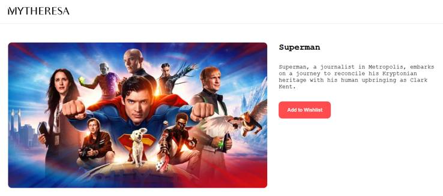

# 🎬 Mytheresa - Frontend Engineer Technical Challenge

Movie browsing application with dynamic carousels, movie detail pages, and wishlist functionality. Developed using React, Vite, Express (for SSR), and SCSS.

---

## 📖 Technical Description

### ✅ Main Features:

- ✅ Homepage with **3 carousels** and a wishlish section:
  - Now Playing
  - Popular
  - Top Rated
  - Wishlisted movies
- ✅ Movie Details Page:
  - Image, description, and **wishlist button**
  - Dynamic styling by category (font + button style)
- ✅ Toggle between **TMDB API** or **local mock data** using `DATASOURCE` in `.env`
- ✅ **SSR** (Server-Side Rendering) with Vite + Express
- ✅ **Tests** implemented with Vitest

---

## 📂 Project Structure

```
src/
  client/
    App.tsx
    features/
      Movies/           # Category carousels and wishlist
      MovieDetails/     # Movie details
    pages/
      HomePage/         # Home with 3 carousels and wishlist
      MovieDetailsPage/ # Movie details page with image, description, and wishlist button
    shared/
      components/       # Reusable UI components (Carousel, Layout, Loading)
      hooks/            # Shared hooks
      services/         # Client-side utilities
  server/
    config/             # env variables setup
    domain/
      models/           # Core domain models (Movie, MovieDetails)
      datasources/      # Abstract datasource interfaces
      repositories/     # Abstract repository interfaces
      use-cases/        # Application logic (Getters)
    infrastructure/
      datasources/      # Datasource implementations (TMDB, Local)
      dtos/             # Data Transfer Objects from APIs
      factories/        # Repository factory
      mappers/          # DTO <-> Domain model transformations
      repositories/     # Repository implementations
    presentation/
      controllers/      # Handles SSR logic, invokes use-cases
      routes/           # Express routes for SSR and APIs
    index.tsx           # Express + Vite server entry point implementing SSR with streaming.
  entry-client.tsx      # Client entry point
  entry-server.tsx      # Server-side entry point
vite.config.ts          # Vite configuration
```

---

## ⚙️ Installation & Execution

⚠️ **Important:** Copy the content of `.env.template` to `.env` and update it with:

- Your TMDB API key (if you want to work with TheMovieDb datasource)
- The `DATASOURCE` variable:
  - `TMDB` → Fetch movies from TheMovieDB API
  - `LOCAL` → Use local mock data

```bash
# Install dependencies
npm install

# Run locally
npm run dev

# Run tests
npm run test

# View test coverage
npm run test:coverage
```

---

## 🔍 Technical Decisions

- **Clean Architecture on the backed**:
  - Separation of concerns between `domain`, `infrastructure`, and `presentation`.
  - Use of **Factories** for dynamic datasource selection (`TMDB` or `LOCAL`).
- **Screaming Architecture on the frontend**:
  - Organizes code by **features** instead of technical layers for better maintainability.
  - Groups related components, hooks, and styles under the same feature folder (e.g., `Movies`, `MovieDetails`).
- **SSR with streaming**: Implemented with React 18 + Vite middleware.
- **Styling**: SCSS for flexibility and BEM methodology.

---

## ✅ Future Improvements

- Add more integration tests.
- Improve accessibility (ARIA labels, keyboard navigation).
- Add more info to the details page.
- Improve overall look and feel.

---

## 📸 Screenshots

### Homepage


### Movie Details



## 👨‍💻 Author

> Technical challenge developed by **Arnau Folch** as part of the selection process for Mytheresa.
